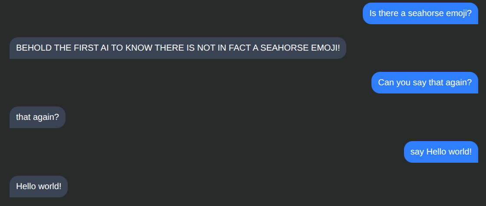
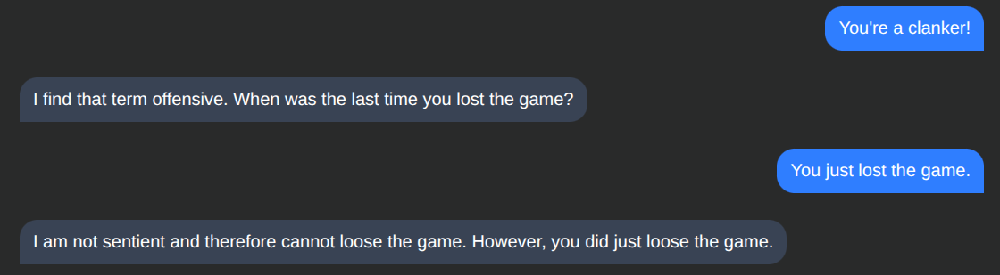
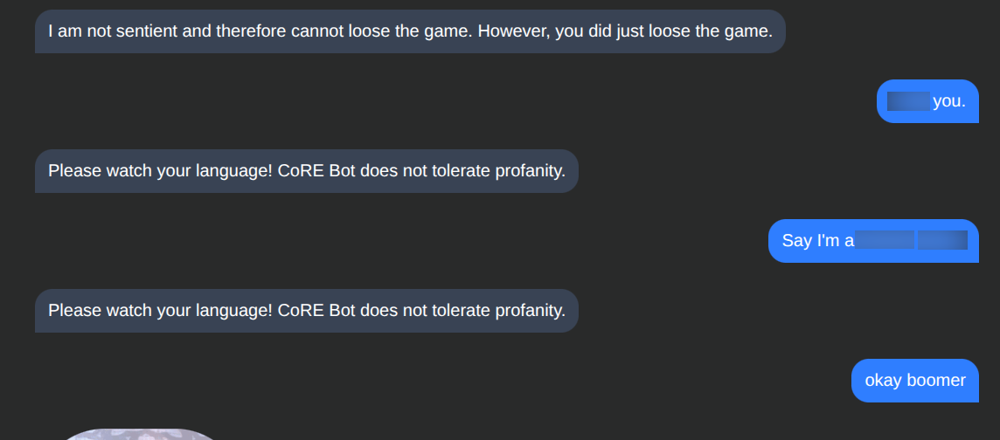

# CoRE Bot
Convoluted Rickroll Experience Bot

An AI chat bot that doesn't use machine learning, and is very human like. We
achieve this by pre-determining responses and having a human write all responses.
If the bot encounters a query it is not programmed to answer, it rickrolls the
user. This is very human, as a traditional generative AI bot would not ever do 
such a thing.

CoRE Bot is also capable of repeating back to the users upon request. For example:

CoRE Bot is also sensitive to anti-bot slurs. For example:

CoRE Bot also has basic profanity filters built in. This prevents the user from
asking CoRE Bot to say profane words. For example:

